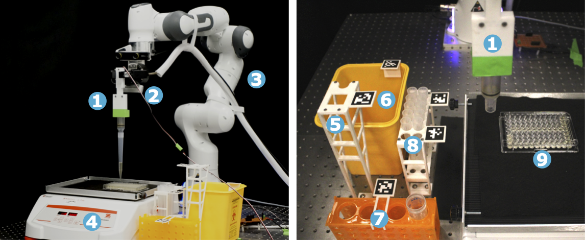

# RoboCulture

This repository accompanies the paper:

**RoboCulture: A Robotics Platform for Automated Biological Experimentation**  
📄 Paper: https://arxiv.org/abs/2505.14941  
🌐 Project website: https://ac-rad.github.io/roboculture

**RoboCulture** is a cost-effective and flexible platform
that uses a general-purpose robotic manipulator to automate
key biological tasks. RoboCulture performs liquid handling, interacts with lab equipment, and leverages computer vision
for real-time decisions using optical density-based growth
monitoring. 

This repository contains instructions to replicate our fully autonomous 15-hour yeast culture experiment where RoboCulture uses vision and force feedback and a modular behavior tree framework to robustly execute, monitor, and manage experiments.


## Repository Structure

```
roboculture/
├── digital-pipette-v2/    # Digital Pipette v2 hardware + software
├── cad-models/            # 3D-printable CAD assets for the yeast culture experiment
├── src/                   # ROS nodes and experiment code
├── static/                # Project website files
├── FastSAM/               # FastSAM submodule
└── readme-imgs/           # Images used in this README
```


## Hardware and Materials

**Required Hardware and Scene Setup**
1. Digital Pipette v2  
   - Follow instructions in [`digital-pipette-v2/`](digital-pipette-v2/) to build the pipette
    - Connect Arduino to the workstation via USB-B
    - Connect the 6 V power supply
    - Attach the Digital Pipette via the three-wire connector
2. Intel RealSense D435i camera
      - Connect to the workstation using a USB-C cable supporting **USB 3.2**
3. Franka Emika robot with Robotiq 2F-85 gripper
4. OHAUS SHHD1619DG Heavy Duty Orbital Shaker Platform
    - Place the 96-well plate on top
    - Connect the shaker to the workstation via RS-232
5. 3D-printed pipette tip remover  
   - CAD: [`pipette_tip_remover_tag_tray_left.stl`](cad-models/pipette_tip_remover_tag_tray_left.stl)
   - Secure to the work table using base mounting holes
6. Biological waste bin
7. Falcon tube rack holding YPD media
8. 3D-printed pipette tip rack  
   - CAD: [`pipette_tip_rack_top_two_trays.stl`](cad-models/pipette_tip_rack_top_two_trays.stl)
   - Secure to the work table using base mounting holes
9. 96-well plate prepared with yeast  
   - Follow preparation protocol described in the paper




## Software Requirements

- **Operating system**: Ubuntu 20.04
- **ROS Version**: Noetic


## Setup

### 1) Clone the Repository

```bash
git clone https://github.com/ac-rad/roboculture.git
cd roboculture
```

May need to run:
```bash
git submodule update --init --recursive
```

---

### 2) Create and Activate the Python Environment

```bash
python -m venv roboculture
source roboculture/bin/activate
pip install -r requirements.txt
```

**Additional dependencies**
```bash
pip install ultralytics==8.0.120
pip install clip
pip install pyrealsense2
pip install autolab-perception
```

**FastSAM setup**
1. Download model weights from  
   https://github.com/CASIA-LMC-Lab/FastSAM#model-checkpoints
2. Create a `weights/` directory at the repo root
3. Place the model at:
   ```
   weights/FastSAM-x.pt
   ```

**FrankaPy**
- Follow installation instructions from:  
  https://github.com/iamlab-cmu/frankapy

---

### 3) Hardware Configuration

- Verify USB device IDs and serial ports: run `ls /dev/ttyUSB* /dev/ttyACM*` to list serial devices
- Confirm RealSense camera is operating
- Confirm RS-232 connection to the shaker


## Calibration

### Camera Calibration

1. Capture **10–15 chessboard images**
2. Place images in:
   ```
   camera_cal_imgs/
   ```
3. Run:
   ```bash
   python src/calibrate_camera.py
   ```
4. Move the generated file to:
   ```
   src/camera_cal_imgs/calibration.npz
   ```

This is the path used by the perception node.

### Pipette Calibration
- Calibrate the Digital Pipette v2 as described in section 3.3 of [the original Digital Pipette paper](https://pubs.rsc.org/en/content/articlepdf/2023/dd/d3dd00115f)


## Running the Experiment

### 1) Sample Preparation

From Section F of the paper:

> *Saccharomyces cerevisiae* was maintained on agarose plates containing 2% agarose in YPD broth at 4 °C under sterile conditions. Cell expansion, dilution, and plate preparation were performed as described in https://pubmed.ncbi.nlm.nih.gov/30320748/. Two identical 96-well plates were prepared: one for robotic handling and one for reference optical density measurements.


### 2) Launch the System

#### Camera (if using Docker, launch outside Docker)

```bash
roslaunch realsense2_camera rs_camera.launch \
  enable_depth:=false \
  color_width:=1920 \
  color_height:=1080 \
  color_fps:=30
```

---

### Terminal Setup

> **Important:** For each step below, open a **new terminal window**.

```bash
docker exec -it <your_docker_env> bash
source ~/git/robotiq_ws/devel/setup.bash
cd roboculture/
source roboculture/bin/activate
source /opt/ros/noetic/setup.bash
source ~/git/frankapy/catkin_ws/devel/setup.bash
source devel/setup.bash
```

---

### 3) Launch Nodes (in order)

**Dynamic reconfigure**
```bash
rosrun cell_culture cell_culture_global_reconfigure.py
```

**Gripper controller**
```bash
cd ~/git/robotiq_ws/src/robot_interface/scripts/
python robotiq_dynamixel_runner.py
```

**Device controller**
```bash
python src/cell_culture/src/device_controller.py
```

**Control node**
```bash
rosrun cell_culture cc_control_node.py
```

**Perception node**
```bash
rosrun cell_culture cc_perception_node.py
```

**Behavior tree**
```bash
rosrun cell_culture experiment_btree.py
```


## Visualization Tools

Run these **outside Docker** in separate terminals.

Open dynamic reconfigure UI:
```
rosrun rqt_gui rqt_gui -s reconfigure
```
Open rviz to view camera outputs and image overlays for debugging:
```
rviz
```
Open behaviour tree visualizer:
```
rosrun rqt_py_trees rqt_py_trees
```
Plot realtime well growth:
```
rqt_plot /cell_culture/plate_growth
```

---

## Troubleshooting

### RealSense USB Errors

**Symptoms**
- `Resource temporarily unavailable (Error 11)`
- `USB CAM overflow`
- Failure to launch at desired resolution

**Fix**
- Ensure the RealSense is connected via **USB 3.x**
- Replace the cable if necessary
- Verify USB type in the launch log
