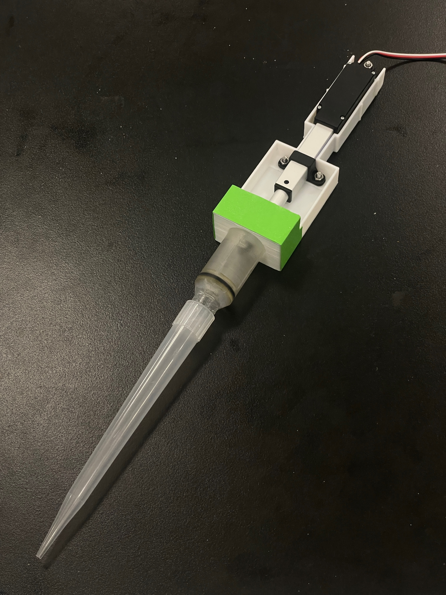
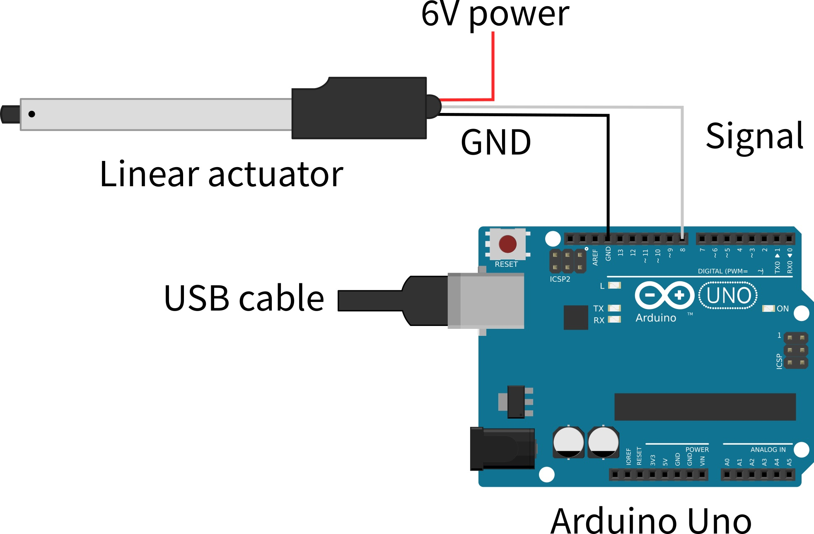
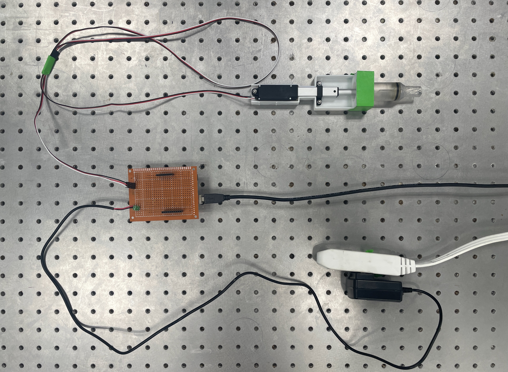
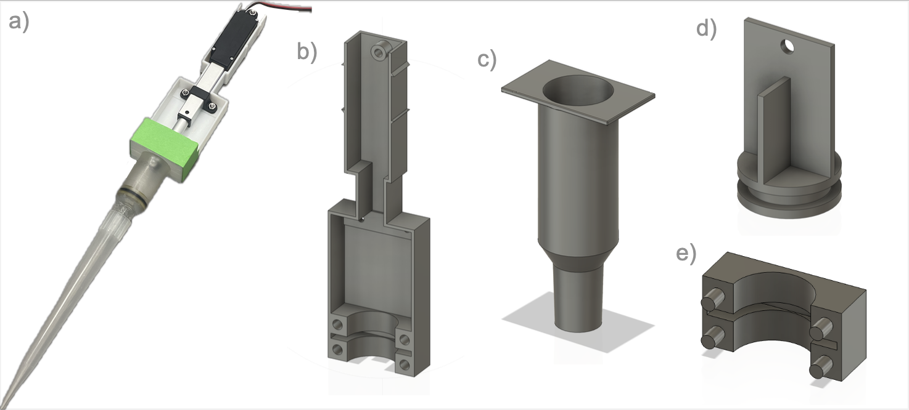

# Digital Pipette v2

This directory contains CAD files and programs for the Digital Pipette v2 introduced in [RoboCulture: A Robotics Platform for Automated Biological Experimentation](https://doi.org/10.48550/arXiv.2505.14941). It is the successor to the original Digital Pipette introduced [here](https://doi.org/10.1039/D3DD00115F) and avaliable on GitHub [here](https://github.com/ac-rad/digital-pipette).




## Bill of Materials
| Item | Quantity | Description |
| --- | --- | --- |
| [Linear actuator](https://www.actuonix.com/l16-50-63-6-r) | 1 | Actuonix L16-50-63-6-R |
| [DC 6V power supply](https://www.actuonix.com/dcpowersupply) | 1 | DC Linear Actuator Power Supply* |
| [Arduino](https://store-usa.arduino.cc/products/arduino-uno-rev3) | 1 | Arduino Uno Rev3** |
| [Pipette Tips](https://www.sigmaaldrich.com/CA/en/product/sigma/z740090?srsltid=AfmBOoqENiqRej9o1Fh8WpmBl-x27AytvgyorUww807KblMdqG__zZBk) | - | Sigma-Aldrich BRAND pipette tips, 1-10 mL |
| [O-ring](https://www.amazon.ca/dp/B0DKJ5TKH8) | 1 | Approx. inner diameter of 17 mm, width of 2.5 mm
| [Grease](https://www.dupont.com/products/molykote-high-vacuum-grease.html) | - | MOLYKOTE High-Vacuum Grease, DuPont
| Short screws & nuts | 3 | M3 10 mm screws and M3 nuts were used |
| Long screw & nut | 1 | M3 20 mm screw and M3 nut were used |

>Basic electronic parts (e.g. breadboard, cables, soldering iron, etc.) are not included in this list.

>\* Any other DC 6V power supply should work.

>** Any other Arduino-compatible boards should work.

## Electric Circuit


>Although it is not drawn explicitly, ensure that the GND of Arduino and DC 6V power supply are connected.

### Example Setup
You can connect the Arduino, the linear actuator, and the 6V power supply using jumper wires and alligator cables. This setup works for development, but it is not recommended for production since cables get easily disconnected. Soldering wires is recommended to make connections more stable. The example shown below uses a PCB prototyping board.




## Build Instructions

We will refer to the 3D printed components by the following names:  (a) Pipette, (b) platform, (c) syringe, (d) plunger, and (e) cover.



### Step 1
Prepare items shown in the bill of materials. Print the [platform](https://github.com/ac-rad/roboculture/blob/main/digital-pipette-v2/stl/dpv2_platform.stl), [plunger](https://github.com/ac-rad/roboculture/blob/main/digital-pipette-v2/stl/dpv2_plunger.stl), [syringe](https://github.com/ac-rad/roboculture/blob/main/digital-pipette-v2/stl/dpv2_syringe.stl) and [syringe cover](https://github.com/ac-rad/roboculture/blob/main/digital-pipette-v2/stl/dpv2_cover.stl) with a 3D printer. We printed the platform and the cover using white [ANYCUBIC PLA](https://store.anycubic.com/products/pla-filament?variant=28613838635068) with a [KP3S printer](https://kingroon.com/products/official-kingroon-kp3s-3d-printer?srsltid=AfmBOoouSShLhwt5UxNMyRfsJzguQAaet1WOk76gDIyBJmFdmgcyfKbj), and the syringe and plunger pieces were printed with [Clear Resin V4](https://formlabs.com/store/materials/clear-resin-v4/?srsltid=AfmBOorUXbHxEBsoq4NVLikjujRHokVETI2yYDyIPURNv1b0i4osuqV6) using a [Form 3L printer](https://formlabs.com/3d-printers/form-3l/?srsltid=AfmBOopiq-vRPgbCmxs518tfKLkiUMFvQhNmBW-FyH8gnUD7D1ZHYR3r). 


### Step 2
Connect the end of the linear actuator to the plunger piece with a short screw and a nut.

### Step 3
Place an O-ring in the groove of the plunger piece. NOTE: A thin layer of electrical tape underneath the O-ring may help for maintaining an air-tight seal. 

### Step 4
Apply grease to the end of the plunger piece over the O-ring, and inside the syringe piece. Place the plunger piece inside the syringe.


### Step 5
Place the linear actuator into the platform such that the top of the syringe piece lies in the groove of the platform. Secure the actuator in place with the plastic parts shipped with the actuator. We placed a flat mounting strap underneath the actuator and the U-shaped bracket piece on top of the actuator, and used two short screws (10mm) and nuts to secure everything to the platform. We used a long screw (20mm) and nut to secure the top of the actuator to the top of the platform.

### Step 6
Place the cover piece over the syringe to hold it to the platform. OPTIONAL: Use tape to secure the cover.


### Step 7
Connect the linear actuator with the electric circuit.

## Source code
The [src](https://github.com/ac-rad/roboculture/blob/main/digital-pipette-v2/src) directory contains example code to operate the Digital Pipette v2.
- `pipette.ino` is an example Arduino sketch
- `controller.py` is an example Python program to send serial commands from PC to the Arduino

## Citation
If you find this useful in your research, please consider citing as below.

```
@misc{angers2025roboculture,
      title={RoboCulture: A Robotics Platform for Automated Biological Experimentation}, 
      author={Kevin Angers and Kourosh Darvish and Naruki Yoshikawa and Sargol Okhovatian and Dawn Bannerman and Ilya Yakavets and Florian Shkurti and Alán Aspuru-Guzik and Milica Radisic},
      year={2025},
      eprint={2505.14941},
      archivePrefix={arXiv},
      primaryClass={cs.RO},
      url={https://arxiv.org/abs/2505.14941}, 
}
```

## License
The pipette is licensed under the [Creative Commons Attribution 4.0 International License][cc-by].

[![CC BY 4.0][cc-by-image]][cc-by]

[cc-by]: http://creativecommons.org/licenses/by/4.0/
[cc-by-image]: https://i.creativecommons.org/l/by/4.0/88x31.png

The source code is licensed under the MIT license.